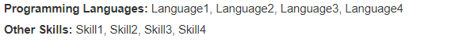

# ModRes - Modular Resume Builder

## Overview

Built this because I was tired of managing resumes via copy paste. This app allows you to add and remove parts of your resume via toggle and save them to pdfs.


## Installation

```
git clone
cd ModRes
pip install -r requirements.txt
python run.py
```

From here, you can play around with `full_resume.txt` or read further for more detailed instructions and formatting

## Template Format

### Personal Information

- Everything before the first seen header (`#`) is considered personal information.
- The first line will always be the name, which will be bolded and centered at the top of the resume.
- All other personal information is listed below the name in regular text, separated by vertical bars.

Example:

```
Jobby McJobFace
123-456-7890
email@email.com
linkedin.com/in/username
https://github.com/username
```

Renders


### Sections

To create a new section, use the `#` symbol to label the new section.

```
# New Header
```


### Entries

Each entry in a section follows this format:

```
Text1 (Company in example below)
Text2 (Date in example below)
Text3 (Title in example below)
Text4 (Location in example below)
- as many
- bullet points
- as you want
```


If you do not want to include one of the texts, you can write `/none` and it will be treated as an empty string.

```
Weather Wizard
/none
Forecasting Application
JavaScript, React, OpenWeatherMap API
- One of the projects of all time
- Definitely not copy and pasted from an online tutorial
- Please hire me
```


### Lists

Lists are a special type of entry used for items you don't want to take up as much space !

To create a list, use the `/list` keyword followed by the list name and the items in parentheses.

Example:

```
/list (Programming Languages)(Language1, Language2, Language3, Language4)
/list (Other Skills)(Skill1, Skill2, Skill3, Skill4)
```



### Resume Style

If you do not like the default resume style and know css, you can edit `resume_style.css` to fit your preferences.
